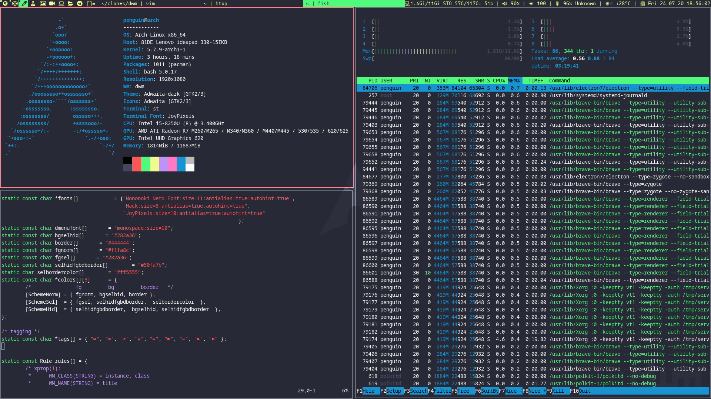
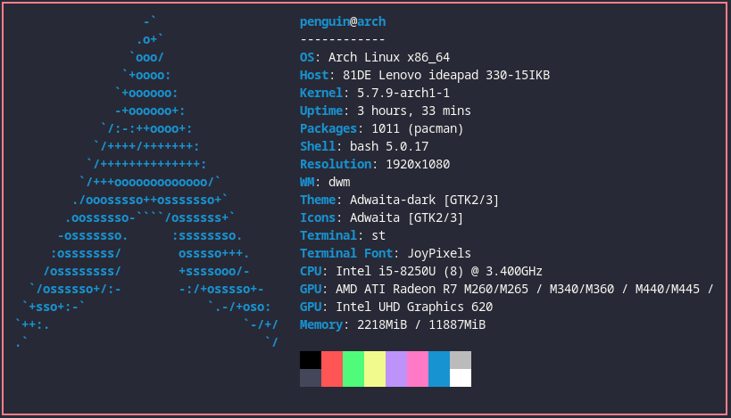

# My Linux Setup

## ScreenShot

**Distro:** [Arch Linux](https://www.archlinux.org/) A simple, lightweight distribution

**Desktop Environment:** None

**Window Manager:** [DWM - Dynamic Window Manager](https://dwm.suckless.org/)

**Terminal:** [Suckles Simple Terminal](https://st.suckless.org/) easy to configure and customize.

**Wallpaper:** 

**Color Scheme:** [Dracula Color Scheme](https://github.com/dracula/dracula-theme) very easy on the eye.

Palette      | Hex       | 
---          | ---       | ---
Background   | `#282a36` | 
Current Line | `#44475a` | 
Selection    | `#44475a` | 
Foreground   | `#f8f8f2` | 
Comment      | `#6272a4` | 
Cyan         | `#8be9fd` | 
Green        | `#50fa7b` | 
Orange       | `#ffb86c` | 
Pink         | `#ff79c6` | 
Purple       | `#bd93f9` | 
Red          | `#ff5555` | 
Yellow       | `#f1fa8c` | 

